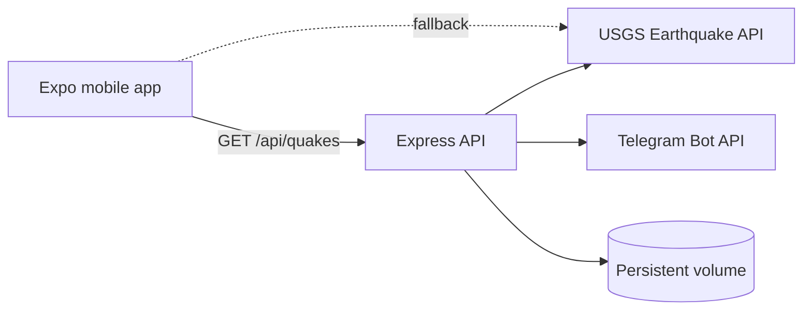

# AlmaQuake

[English](README.md) | [Русский](README.ru.md)

<p align="center">
  
</p>

<p align="center">
  Earthquake monitoring and emergency guidance for Almaty.
</p>

<p align="center">
  <a href="https://github.com/serik-k/AlmaQuake/actions/workflows/ci.yml"></a>
  
  
  <a href="LICENSE"></a>
</p>

AlmaQuake is a multilingual mobile app that tracks recent earthquakes near Almaty, Kazakhstan. It combines live earthquake data with practical safety instructions and quick access to Kazakhstan's 112 emergency number.

> [!IMPORTANT]
> AlmaQuake is an informational project, not an official early-warning system. During an emergency, follow instructions from local authorities and emergency services.

## Features

- Recent earthquake feed for the Almaty area, powered by USGS data
- Magnitude, depth, distance, coordinates, and source-event details
- Sorting and magnitude filters with pull-to-refresh
- Safety checklists for before, during, and after an earthquake
- One-tap access to Kazakhstan's 112 emergency number
- Russian, Kazakh, and English interface
- Optional Express backend with rate limiting, persistent state, and Telegram alerts
- Direct USGS fallback when the backend is unavailable

## Architecture



The mobile client lives in `app/` and `src/`. The optional Node.js backend is isolated in `server/`; it polls USGS, serves normalized earthquake data, and can publish Telegram alerts.

## Tech stack

- Expo 54, React Native 0.81, React 19, and Expo Router
- TypeScript, i18next, and React Navigation
- Node.js, Express, and express-rate-limit
- USGS Earthquake Catalog API and Telegram Bot API
- Railway-compatible persistent storage

## Getting started

### Prerequisites

- Node.js 20 or newer
- npm
- Expo Go, an Android emulator, or an iOS simulator

### Mobile app

```bash
git clone https://github.com/serik-k/AlmaQuake.git
cd AlmaQuake
npm install
cp .env.example .env
npm start
```

`EXPO_PUBLIC_API_URL` is optional. Leave it empty to query USGS directly, or point it to a running AlmaQuake backend.

Platform shortcuts:

```bash
npm run android
npm run ios
npm run web
```

Native development builds additionally require local Firebase configuration files. See [Firebase configuration](#firebase-configuration).

### Backend

```bash
cd server
npm install
npm run dev
```

The backend runs on port `3000` by default. Telegram alerts are disabled when `TELEGRAM_BOT_TOKEN` is not set. In production, configure variables from `server/.env.example` in the hosting platform; do not commit a populated `.env` file.

Available endpoints:

| Method | Endpoint | Purpose |
| --- | --- | --- |
| `GET` | `/api/quakes` | Recent normalized earthquake data |
| `POST` / `DELETE` | `/api/register` | Register or remove a device token |
| `GET` | `/api/stats` | Admin-protected service statistics |
| `POST` | `/api/test-telegram` | Admin-protected test alert |

## Configuration

### Mobile environment

| Variable | Required | Description |
| --- | --- | --- |
| `EXPO_PUBLIC_API_URL` | No | AlmaQuake backend base URL; empty uses direct USGS access |

### Server environment

| Variable | Required | Description |
| --- | --- | --- |
| `PORT` | No | HTTP port, defaults to `3000` |
| `ADMIN_SECRET` | Production | Protects administrative endpoints |
| `TELEGRAM_BOT_TOKEN` | No | Enables the Telegram bot and alerts |
| `ALLOWED_ORIGINS` | No | Comma-separated CORS origins |
| `DATA_DIR` | Production | Persistent data directory, such as `/data` on Railway |
| `FIREBASE_CONFIG` | No | Firebase Admin JSON configuration for future push support |

### Firebase configuration

The following native configuration files are intentionally ignored by Git:

- `google-services.json`
- `GoogleService-Info.plist`
- `server/firebase-service-account.json`

Download project-specific files from Firebase and keep them local. Never commit service-account credentials.

## Quality checks

```bash
npm run lint
npm run typecheck
npm --prefix server run build
```

GitHub Actions runs the same checks for every push and pull request.

## Contributing

Bug reports and focused pull requests are welcome. See [CONTRIBUTING.md](CONTRIBUTING.md) before submitting changes.

## License

Released under the [MIT License](LICENSE).
