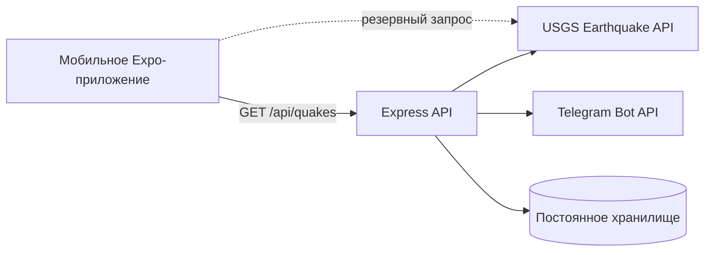

# AlmaQuake

[English](README.md) | [Русский](README.ru.md)

<p align="center">
  
</p>

<p align="center">
  Мониторинг землетрясений и инструкции на случай чрезвычайной ситуации в Алматы.
</p>

<p align="center">
  <a href="https://github.com/serik-k/AlmaQuake/actions/workflows/ci.yml"></a>
  
  
  <a href="LICENSE"></a>
</p>

AlmaQuake — многоязычное мобильное приложение для отслеживания недавних землетрясений рядом с Алматы, Казахстан. Оно объединяет актуальные сейсмические данные, практические рекомендации по безопасности и быстрый доступ к единому номеру экстренных служб 112.

> [!IMPORTANT]
> AlmaQuake — информационный проект, а не официальная система раннего предупреждения. В чрезвычайной ситуации следуйте указаниям местных органов власти и экстренных служб.

## Возможности

- Лента недавних землетрясений в районе Алматы на основе данных USGS
- Магнитуда, глубина, расстояние, координаты и ссылка на первоисточник события
- Сортировка, фильтр по магнитуде и обновление жестом pull-to-refresh
- Инструкции по безопасности до, во время и после землетрясения
- Быстрый вызов единого номера экстренных служб Казахстана 112
- Интерфейс на русском, казахском и английском языках
- Опциональный Express backend с rate limiting, постоянным хранилищем и Telegram-оповещениями
- Прямой запрос к USGS, если backend недоступен

## Архитектура



Мобильный клиент расположен в каталогах `app/` и `src/`. Опциональный Node.js backend находится в `server/`: он опрашивает USGS, возвращает нормализованные данные о землетрясениях и может отправлять оповещения в Telegram.

## Технологии

- Expo 54, React Native 0.81, React 19 и Expo Router
- TypeScript, i18next и React Navigation
- Node.js, Express и express-rate-limit
- USGS Earthquake Catalog API и Telegram Bot API
- Постоянное хранилище, совместимое с Railway

## Быстрый старт

### Требования

- Node.js 20 или новее
- npm
- Expo Go, Android Emulator или iOS Simulator

### Мобильное приложение

```bash
git clone https://github.com/serik-k/AlmaQuake.git
cd AlmaQuake
npm install
cp .env.example .env
npm start
```

Переменная `EXPO_PUBLIC_API_URL` необязательна. Оставьте её пустой для прямых запросов к USGS или укажите адрес запущенного AlmaQuake backend.

Команды для отдельных платформ:

```bash
npm run android
npm run ios
npm run web
```

Для нативных development builds также понадобятся локальные файлы Firebase. Подробнее — в разделе [Конфигурация Firebase](#конфигурация-firebase).

### Backend

```bash
cd server
npm install
npm run dev
```

По умолчанию сервер запускается на порту `3000`. Telegram-оповещения отключены, если не задана переменная `TELEGRAM_BOT_TOKEN`. В production задайте переменные из `server/.env.example` в настройках хостинга и не добавляйте заполненный `.env` в Git.

Доступные endpoints:

| Метод | Endpoint | Назначение |
| --- | --- | --- |
| `GET` | `/api/quakes` | Нормализованные данные о недавних землетрясениях |
| `POST` / `DELETE` | `/api/register` | Регистрация или удаление токена устройства |
| `GET` | `/api/stats` | Защищённая административная статистика |
| `POST` | `/api/test-telegram` | Защищённая отправка тестового оповещения |

## Конфигурация

### Переменные мобильного приложения

| Переменная | Обязательна | Описание |
| --- | --- | --- |
| `EXPO_PUBLIC_API_URL` | Нет | Базовый URL AlmaQuake backend; пустое значение включает прямой запрос к USGS |

### Переменные сервера

| Переменная | Обязательна | Описание |
| --- | --- | --- |
| `PORT` | Нет | HTTP-порт, по умолчанию `3000` |
| `ADMIN_SECRET` | В production | Защищает административные endpoints |
| `TELEGRAM_BOT_TOKEN` | Нет | Включает Telegram-бота и оповещения |
| `ALLOWED_ORIGINS` | Нет | Разрешённые CORS origins через запятую |
| `DATA_DIR` | В production | Каталог постоянных данных, например `/data` на Railway |
| `FIREBASE_CONFIG` | Нет | JSON-конфигурация Firebase Admin для будущей поддержки push-уведомлений |

### Конфигурация Firebase

Следующие нативные файлы намеренно исключены из Git:

- `google-services.json`
- `GoogleService-Info.plist`
- `server/firebase-service-account.json`

Скачайте файлы своего проекта из Firebase и храните их только локально. Никогда не публикуйте данные service account.

## Проверка качества

```bash
npm run lint
npm run typecheck
npm --prefix server run build
```

GitHub Actions запускает эти проверки для каждого push и pull request.

## Участие в разработке

Сообщения об ошибках и небольшие целевые pull requests приветствуются. Перед отправкой изменений прочитайте [CONTRIBUTING.md](CONTRIBUTING.md).

## Лицензия

Проект распространяется по [лицензии MIT](LICENSE).
